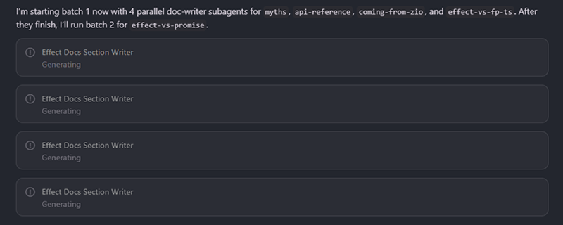

# Local Library Docs for LLM Agents



Generate 118 library-specific docs in parallel using AI subagents. Achieves 100% pass rate on coding tasks vs 53-79% with retrieval tools.

A step-by-step guide to building retrieval-optimised local documentation using AI subagents.

This repo uses Effect as the worked example, but the pattern applies to any library. Swap the source file, folder names, and section taxonomy for your own stack.

## Background

Vercel found that embedding a compressed docs index directly in `AGENTS.md` achieved a **100% pass rate** on framework-specific coding tasks, compared to 53-79% when relying on skill/tool invocation.

The key insight: **passive context beats active retrieval**. When docs are always available in the agent's context, there is no decision point where the agent has to choose whether to look something up.

Reference: [AGENTS.md outperforms skills in our agent evals](https://vercel.com/blog/agents-md-outperforms-skills-in-our-agent-evals)

This guide shows how to take that idea further by using subagents to generate an entire local docs corpus from a single source file, then wire it into your project so agents can retrieve version-matched documentation on every turn.

## What You End Up With

```text
.
|-- agents.md                              # project rules for the AI agent
|-- llms-full.txt                          # source corpus (full docs dump)
|-- effect-docs/                           # generated local docs (by section)
|   |-- getting-started/
|   |-- error-management/
|   |-- schema/
|   |-- ...
|-- completed-subsections.md               # tracks which docs are done
|-- pending-subsections.md                 # reset tracker (all pending)
|-- effect-docs-index-pipe-notation.md     # compressed index for AGENTS.md
|-- .cursor/agents/
|   |-- effect-docs-section-writer.md      # subagent definition
```

## Step 1: Get Your Source Corpus

Most libraries publish an LLM-friendly docs export. For Effect, that file is `llms-full.txt`. Download it and place it in your repo root.

If your library does not have one, you can scrape the docs site into a single markdown file. The important thing is having one authoritative source file.

## Step 2: Define Your Section Taxonomy

Create `completed-subsections.md` in your repo root. List every major section and subsection you want to generate, all marked as pending:

```md
## getting-started

- [ ] Introduction
- [ ] Installation
- [ ] The Effect Type
- [ ] Creating Effects
- [ ] Running Effects

## error-management

- [ ] Expected Errors
- [ ] Unexpected Errors
- [ ] Retrying
```

This file is your roadmap and progress tracker. You will mark items `[x]` as docs are generated.

### Feeding sections to the agent with XML

When telling the agent which sections and subsections to process, you can paste them in a simple XML structure. This makes it easy to hand over an entire taxonomy in one message:

```xml
<micro>
Getting Started
Micro for Effect Users
</micro>

<platform>
Introduction
Command
FileSystem
KeyValueStore
Path
PlatformLogger
Runtime
Terminal
</platform>
```

The agent reads the tag name as the major section and each line as a subsection. This is a fast way to queue up work without having to type out individual prompts for every item.

## Step 3: Create a Subagent

Place a subagent definition at `.cursor/agents/effect-docs-section-writer.md`. This tells Cursor how to delegate documentation tasks.

The subagent in this repo is configured for Effect. To adapt it for your library, update the source file path, output folder, and tracker file name inside the subagent markdown.

See `.cursor/agents/effect-docs-section-writer.md` for the full definition used in this project.

## Step 4: Generate Docs with Subagent Delegation

This is where the workflow gets powerful. Instead of writing each doc manually, you delegate to subagents in parallel batches.

### Writing a single subsection

Ask your agent:

```
complete getting-started, the effect type
```

The agent (or subagent) will:
1. Find "The Effect Type" section in `llms-full.txt`
2. Create `effect-docs/getting-started/the-effect-type.md`
3. Mark `The Effect Type` as `[x]` in `completed-subsections.md`

### Delegating a batch of 4 in parallel

Ask your agent:

```
delegate to subagents: creating effects, running effects, using generators, building pipelines
— do batches of 4
```

This launches 4 subagents simultaneously, each handling one subsection. Each subagent independently:
- Extracts content from the source corpus
- Writes one doc file
- Updates the completion tracker
- Retries if the tracker edit conflicts with another subagent

### Running through an entire section

Ask your agent:

```
proceed with error-management
```

The agent queues all pending subsections in that section and processes them in waves of 4:

- **Batch 1**: Two Types of Errors, Expected Errors, Unexpected Errors, Fallback
- **Batch 2**: Matching, Retrying, Timing Out, Sandboxing
- **Batch 3**: Error Accumulation, Error Channel Operations, Parallel and Sequential Errors, Yieldable Errors

After each batch, the agent verifies all files were created and all tracker entries are marked complete before starting the next batch.

### Processing all remaining sections

Ask your agent:

```
go through all of them, use the same delegation pattern
```

The agent reads `completed-subsections.md`, identifies every pending subsection across all sections, and processes them in sequential batches of 4 until everything is complete.

In this project, that meant generating **118 docs** across **21 major sections** in about 23 batches.

## Step 5: Add Frontmatter

Each generated doc should have YAML frontmatter for discoverability:

```yaml
---
title: The Effect Type
description: Learn how Effect<Success, Error, Requirements> models lazy workflows with typed success values, expected errors, and contextual dependencies for composable programs.
---
```

You can add frontmatter in bulk by delegating to subagents again:

```
delegate to subagents to go through each doc and add a title and description at the top
```

### Frontmatter quality standard

Descriptions should be:
- One sentence, about 20-35 words
- Mention 2-4 concrete APIs or concepts
- State what the reader will learn or do

If the initial descriptions are too generic, run a refinement pass:

```
run a pass to make all descriptions more descriptive — 20-35 words, concrete APIs, clear outcome
```

## Step 6: Build the Pipe Index

Create a compressed docs index that can be embedded in `AGENTS.md` or used as passive context. The format is pipe-delimited to minimise token usage:

```text
[Effect Docs Index]|root: ./effect-docs
|IMPORTANT: Prefer retrieval-led reasoning over pre-training-led reasoning for any Effect tasks.
|getting-started:{building-pipelines.md,control-flow-operators.md,creating-effects.md,...}
|error-management:{expected-errors.md,fallback.md,matching.md,retrying.md,...}
|schema:{basic-usage.md,filters.md,transformations.md,...}
```

This gives the agent a map of every available doc file without loading any of the content into context. The agent reads specific files only when it needs them.

## Step 7: Wire into AGENTS.md

Add the pipe index content to your project's `agents.md` (or `AGENTS.md` / `CLAUDE.md` depending on your tool). The agent now has passive access to the full docs map on every turn.

## Adapting for Another Library

Effect is just the example. To use this with React, Next.js, Prisma, or any other library:

1. **Source corpus**: Replace `llms-full.txt` with your library's docs export.
2. **Docs folder**: Rename `effect-docs/` to match your library (e.g. `nextjs-docs/`).
3. **Section taxonomy**: Update `completed-subsections.md` with your library's doc structure.
4. **Subagent config**: Copy `.cursor/agents/effect-docs-section-writer.md` and update the file paths and library name.
5. **Pipe index**: Regenerate the index to point to your new docs root and files.

The subagent in this repo is intentionally left as the Effect-specific implementation so it serves as a concrete reference.

## How Parallel Tracker Conflicts Are Handled

When 4 subagents run simultaneously and all try to update `completed-subsections.md`, edits can collide. The solution:

1. Each subagent re-reads the tracker immediately before writing.
2. Each subagent applies a narrow, single-line change (only its own checkbox).
3. If the edit fails due to stale content, the subagent re-reads and retries.

This pattern handled all 118 subsections across 23 parallel batches without manual intervention.

## Checklist Per Batch

- [ ] 4 subagent tasks delegated
- [ ] 4 doc files created
- [ ] 4 tracker lines marked `[x]`
- [ ] Lint/diagnostics clean
- [ ] Next batch queued

## Maintenance

**Adding new subsections**: Add the item to `completed-subsections.md` as pending, generate the doc with the subagent, then update the pipe index.

**Resetting the tracker**: Create `pending-subsections.md` by copying the structure from `completed-subsections.md` with all checkboxes reset to `[ ]`.

**Folder renames**: Update the subagent config, pipe index root, and `agents.md` references.

## Common Pitfalls

- **Tracker collisions**: Solved by read-before-write with retry (see above).
- **Path mismatches**: Make sure the subagent, prompts, and pipe index all point to the same docs folder.
- **Frontmatter drift**: Run a bulk normalisation pass after major generation runs.
- **Unexpected git commits**: Some subagent runtimes auto-commit. Check `git status` after each batch.

## License

This project is dedicated to the public domain under `CC0 1.0`.

Take whatever you want: use, copy, modify, and distribute it for any purpose without asking permission.
See `LICENSE` for details.

---

Built with subagent delegation, retrieval-first context design, and repeatable quality checks. Effect is the example; bring your own library.
